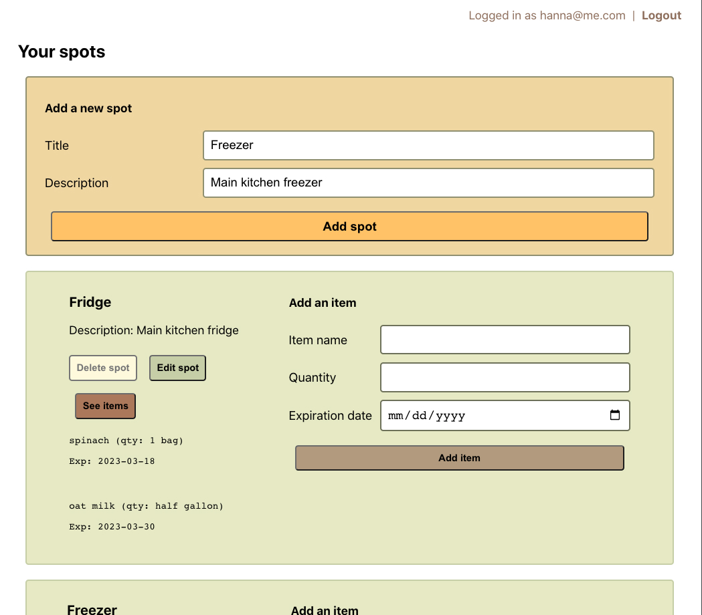

# Wastewise
Wastewise helps you keep track of groceries and minimize food waste.

I was inspired by my own need when I noticed ingredients spoiling in the fridge that I bought eagerly 2 weeks ago thinking that I was going to cook an elaborate dish, only to be neglected to the trash. Self-reminder to be mindful what you're putting in your basket when grocery shopping on an empty stomach hehe. 

Zooming out to food waste stats in the US, the Environmental Protection Agency and the U.S. Department of Agriculture stated that food waste is estimated to be 30-40% of the entire US food supply, equating to about 219 pounds of waste per person.

This project is a full-stack application created independently. Check out the client-side code here: - [Wastewise front-end repository](https://github.com/hannaner/wastewise-client)

References on food waste:
- [Food waste guide by RTS](https://www.rts.com/resources/guides/food-waste-america/)
- [USDA on food waste](https://www.usda.gov/foodwaste/faqs)

## Tech stack
|          | Technologies used              |
|----------|--------------------------------|
| Backend  | Django, Python, PostgreSQL     |
| Frontend | React, JavaScript, HTML, CSS   |
| Other    | Django Frameworks, Git, Render |

## Getting Started
- Live site: https://wastewise.onrender.com
- [Project planning](https://trello.com/invite/b/PEh64K59/ATTI39744314898e569baea8946417d090d1194B91FC/project-4)

### Walkthrough
<figure>
    <figcaption>Entity relationship diagram (ERD)</figcaption>
    
</figure>
<figure>
    <figcaption>Login</figcaption>
    
</figure>
<figure>
    <figcaption>Create spot</figcaption>
    
</figure>
<figure>
    <figcaption>Add items to your spot</figcaption>
    
</figure>

## Next Steps
### Version 2
- AAU, I want to edit an item's details.
- AAU, I want to delete an item from a spot.
- AAU, I want to see an item turn red 2 days before it expires.
- AAU, I want to receive a notification in-app if it's nearing an item's expiration date.
- AAU, I want to sign up via Google OAuth.

### Version 3
- AAU, I want to add items by uploading a picture of a receipt.
- AAU, I'd like to reorder items by click and dragging.
- AAU, I want to share lists with others.
- AAU, I want to upload a picture for each item.
- AAU, I want to change themes.
- AAU, I want a text notification.
- AAU, I want to set my own alert time frame.

*Original repository located here: https://github.com/hannaner/wastewise-server-old*